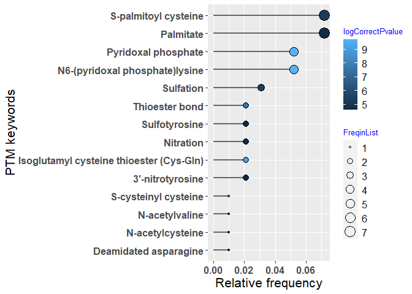
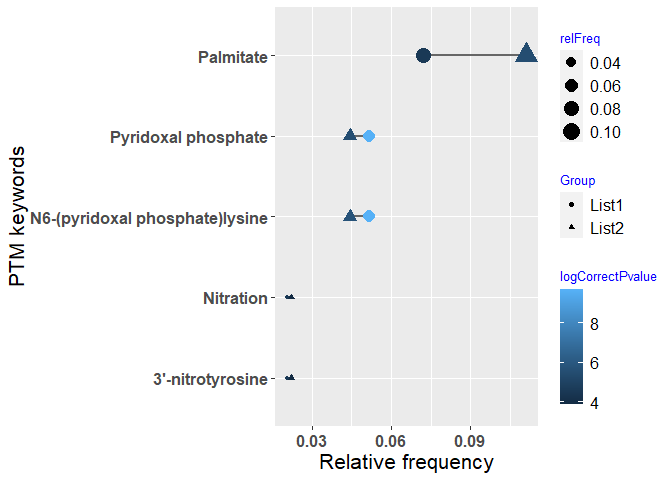
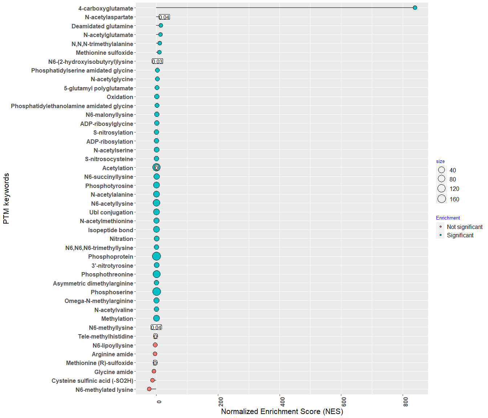
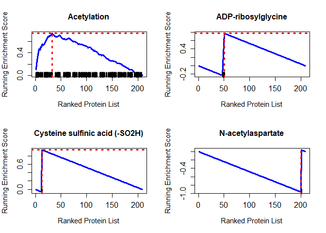
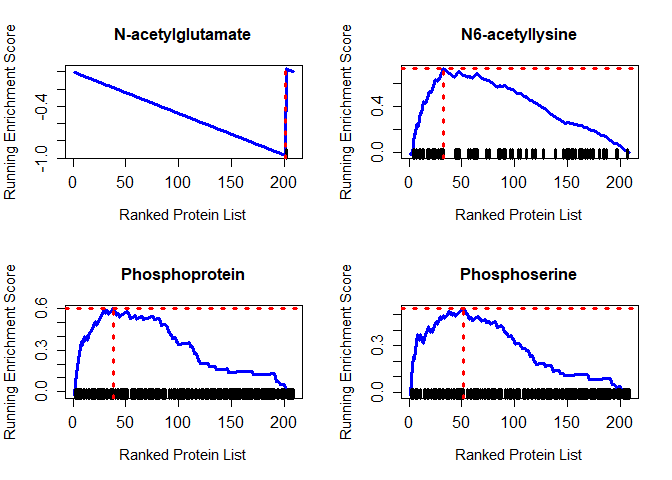

README
================
2022-10-27

# PEIMAN2 <a href='https://github.com/pnickchi/PEIMAN2/'></a>

<!-- badges: start -->

[](https://cran.r-project.org/package=PEIMAN2)
[](https://github.com/jafarilab/PEIMAN2/releases)
[](https://github.com/jafarilab/PEIMAN2)

<!-- badges: end -->

The PEIMAN2 package @PEIMAN2 provides functions and mined database from
UniProt for single enrichment analysis (SEA) and protein set enrichment
analysis (PSEA) in a list of protein. The database is updated regularly
with monthly changes in UniProt/SwissProt repository. To ensure you have
the latest version of database, make sure to install the package from
GitHub.

## Installation

You can install the released version of PEIMAN from
[CRAN](https://CRAN.R-project.org) with:

``` r
install.packages("PEIMAN2")
```

And the development version from [GitHub](https://github.com/) with:

``` r
# install.packages("devtools")
devtools::install_github("jafarilab/PEIMAN2")
# or
devtools::install_github("pnickchi/PEIMAN2")
```

## Example

### Singular Enrichment Analysis (SEA)

``` r
# Load PEIMAN2 package
library(PEIMAN2)

# First example dataset
pl1 <- exmplData1$pl1

# Run SEA on the list
enrich1 <- runEnrichment(protein = pl1, os.name = 'Homo sapiens (Human)')

head(enrich1, n = 6)
```

    ##                                        PTM FreqinPopulation FreqinSample Sample
    ## 1           N6-(pyridoxal phosphate)lysine               53            5     97
    ## 2 Isoglutamyl cysteine thioester (Cys-Gln)                7            2     97
    ## 3                           Thioester bond               11            2     97
    ## 4                           Disulfide bond             3769           33     97
    ## 5                     S-cysteinyl cysteine                3            1     97
    ## 6                     S-palmitoyl cysteine              293            7     97
    ##   Population pvalue corrected pvalue
    ## 1      20423  2e-07            7e-06
    ## 2      20423  4e-06            7e-05
    ## 3      20423  2e-05            2e-04
    ## 4      20423  8e-05            5e-04
    ## 5      20423  7e-05            5e-04
    ## 6      20423  8e-05            5e-04
    ##                                                                                                                                                                                                                                                                       AC
    ## 1                                                                                                                                                                                                                                 Q96QU6; Q4AC99; Q8N5Z0; Q8NHS2; P17174
    ## 2                                                                                                                                                                                                                                                         P01023; A8K2U0
    ## 3                                                                                                                                                                                                                                                         P01023; A8K2U0
    ## 4 P08195; P08908; P28222; P28221; P28566; P30939; P28223; P41595; P28335; P46098; O95264; Q8WXA8; A5X5Y0; Q13639; P47898; P50406; P34969; P21589; P05408; P02763; P19652; P04217; P08697; P02750; P01023; A8K2U0; P05067; P30542; P29274; P29275; P0DMS8; Q9NS82; P22760
    ## 5                                                                                                                                                                                                                                                                 P01009
    ## 6                                                                                                                                                                                                                 P28222; P41595; Q13639; P34969; P30542; P29275; P0DMS8

``` r
# Second example dataset
pl2 <- exmplData1$pl2

# Run SEA on the list
enrich2 <- runEnrichment(protein = pl2, os.name = 'Homo sapiens (Human)')
```

### Plotting SEA for one list

``` r
plotEnrichment(x = enrich1, sig.level = 0.05)
```

<!-- -->

### Integration and matching analysis of two lists

``` r
plotEnrichment(x = enrich1, y = enrich2, sig.level = 0.05)
```

<!-- -->

### Protein Set Enrichment Analysis (PSEA)

``` r
psea_res <- runPSEA(protein = exmplData2, os.name = 'Rattus norvegicus (Rat)', nperm = 100)
head(psea_res[[1]], n = 6)
```

    ##                              PTM pval pvaladj FreqinPopulation FreqinSample
    ## 1                    Acetylation    0       0             1768          123
    ## 2             ADP-ribosylglycine    0       0                4            4
    ## 3 Cysteine sulfinic acid (-SO2H)    0       0                1            1
    ## 4              N-acetylaspartate    0       0                1            1
    ## 5              N-acetylglutamate    0       0                1            1
    ## 6                N6-acetyllysine    0       0              994           73
    ##           ES         NES nMoreExtreme size      Enrichment
    ## 1  0.7521522    1.206495            0  123     Significant
    ## 2  0.7707317    1.591536           23    4     Significant
    ## 3  0.9423077 -455.813953            8    1 Not significant
    ## 4 -0.9615385  224.719101            2    1     Significant
    ## 5 -0.9663462  -13.729508            3    1 Not significant
    ## 6  0.7226249    1.136379            3   73     Significant
    ##                                                                                                                                                                                                                                                                                                                                                                                                                                                                                                                                                                                                                                                                                                                                                                                                                                                                                                                                                                                                                       AC
    ## 1 P0C1X8; P11030; P60711; P63259; Q63028; Q62847; Q62848; Q9WUC4; P31399; P29419; P21571; P15999; D3ZAF6; Q9JJW3; O08839; P0DP29; P0DP30; P0DP31; P18418; P26772; P63039; B0K020; P08081; P08082; P45592; Q91ZN1; P11240; Q63768; P10715; P62898; Q9JHL4; Q7M0E3; P62628; Q07266; P84060; P62870; P15429; P07323; P60841; P56571; B0BN94; P55053; P55051; P07483; Q62658; Q32PX7; Q99PF5; Q5XI73; Q63228; P62994; P01946; P02091; P11517; P62959; P82995; P34058; P27321; Q5XI72; P50411; Q6AXU6; Q5BK20; P11980; Q99MZ8; Q792I0; Q66HF9; P15205; Q5M7W5; P02688; B0BN72; P30904; O35763; P62775; Q71UE8; Q9JJ19; P13084; Q01205; P08461; Q920Q0; O88767; P04785; P31044; O55012; P10111; Q6J4I0; Q9R063; Q9EPC6; P02625; Q63475; P51583; Q68A21; P02401; P62982; P62859; Q6RJR6; Q9JK11; Q63945; B0BN85; P07632; Q66HL2; P28042; O35814; P13668; P37377; Q62880; P19332; P68370; Q6P9V9; Q6AYZ1; Q68FR8; Q5XIF6; Q6PEC1; P11232; P62076; P62078; Q9WV97; P48500; P04692; P58775; Q63610; P09495; Q7M767; Q9Z1A5; P63045
    ## 2                                                                                                                                                                                                                                                                                                                                                                                                                                                                                                                                                                                                                                                                                                                                                                                                                                                                                                                                                                                         P62986; P62982; P0CG51; Q63429
    ## 3                                                                                                                                                                                                                                                                                                                                                                                                                                                                                                                                                                                                                                                                                                                                                                                                                                                                                                                                                                                                                 O88767
    ## 4                                                                                                                                                                                                                                                                                                                                                                                                                                                                                                                                                                                                                                                                                                                                                                                                                                                                                                                                                                                                                 P60711
    ## 5                                                                                                                                                                                                                                                                                                                                                                                                                                                                                                                                                                                                                                                                                                                                                                                                                                                                                                                                                                                                                 P63259
    ## 6                                                                                                                                                                                                                                                                                                                                                                                                                 P11030; Q62848; Q9WUC4; P31399; P29419; P21571; P15999; D3ZAF6; Q9JJW3; P0DP29; P0DP30; P0DP31; P18418; P26772; P63039; B0K020; P08081; P08082; P45592; P11240; P62898; Q9JHL4; Q7M0E3; P07323; P56571; Q62658; Q99PF5; Q5XI73; P62994; P01946; P62959; P82995; P34058; P27321; Q6AXU6; Q5BK20; P11980; Q99MZ8; P02688; B0BN72; P30904; O35763; P62775; Q71UE8; P13084; Q01205; P08461; O88767; P04785; P10111; Q9R063; Q63475; P51583; Q68A21; P02401; P62982; Q9JK11; Q63945; P07632; Q66HL2; P28042; O35814; P13668; P19332; P68370; Q6P9V9; Q6AYZ1; Q68FR8; Q5XIF6; P11232; P48500; P09495; Q9Z1A5
    ##                                                                                                                                                                                                      leadingEdge
    ## 1 P62628; P31044; P37377; P45592; P11030; P02625; P29419; P62775; P21571; O88767; P31399; P02688; P08082; P62898; P63045; P62076; P11232; O35814; Q9WUC4; Q62658; Q63228; P07632; Q5XI73; B0K020; P08081; P62959
    ## 2                                                                                                                                                                                 P62982; P0CG51; P62986; Q63429
    ## 3                                                                                                                                                                                                         O88767
    ## 4                                                                                                                                                                                                         P31044
    ## 5                                                                                                                                                                                                         P31044
    ## 6                                                         P45592; P11030; P29419; P62775; P21571; O88767; P31399; P02688; P08082; P62898; P11232; O35814; Q9WUC4; Q62658; P07632; Q5XI73; B0K020; P08081; P62959

### Plotting PSEA

``` r
plotPSEA(x = psea_res)
```



``` r
plotRunningScore(x = psea_res, nplot = 8) 
```

<!-- --><!-- -->

### Translate PEIMAN results for Mass spectrometry searching tools

``` r
psea2mass(x = psea_res, sig.level = 0.05)
```

    ##      MOD_ID                     name
    ## 1 MOD:00064       N6-acetyl-L-lysine
    ## 2 MOD:00085       N6-methyl-L-lysine
    ## 3 MOD:00127       N6-lipoyl-L-lysine
    ## 4 MOD:00322    1'-methyl-L-histidine
    ## 5 MOD:00051 N-acetyl-L-aspartic acid
    ## 6 MOD:00052      N-acetyl-L-cysteine
    ## 7 MOD:00053 N-acetyl-L-glutamic acid
    ## 8 MOD:00685   deamidated L-glutamine
    ##                                                                                                                                                                                                                                                           def
    ## 1 "converts an L-lysine residue to N6-acetyl-L-lysine." [ChEBI:17752, DeltaMass:214, OMSSA:24, PubMed:11369851, PubMed:11857757, PubMed:11999733, PubMed:12175151, PubMed:14730666, PubMed:15350136, PubMed:1680872, PubMed:670159, RESID:AA0055, Unimod:1#K]
    ## 2                                                                                                              "converts an L-lysine residue to N6-methyl-L-lysine." [ChEBI:17604, DeltaMass:165, PubMed:11875433, PubMed:3926756, RESID:AA0076, Unimod:34#K]
    ## 3                                                                                                    "converts an L-lysine residue to N6-lipoyl-L-lysine." [DeltaMass:0, OMSSA:67, PubMed:3421911, PubMed:3522581, PubMed:7719855, RESID:AA0118, Unimod:42#K]
    ## 4                                                                                "converts an L-histidine residue to tele-methyl-L-histidine." [PubMed:10601317, PubMed:11474090, PubMed:11875433, PubMed:6692818, PubMed:8076, PubMed:8645219, RESID:AA0317]
    ## 5                                                                                                                              "converts an L-aspartic acid residue to N-acetyl-L-aspartic acid." [ChEBI:21547, PubMed:1560020, PubMed:2395459, RESID:AA0042]
    ## 6                                                   "converts an L-cysteine residue to N-acetyl-L-cysteine." [ChEBI:28939, PubMed:11857757, PubMed:11999733, PubMed:12175151, PubMed:14730666, PubMed:1500421, PubMed:15350136, PubMed:6725286, RESID:AA0043]
    ## 7                                                                                                                                              "converts an L-glutamic acid residue to N-acetyl-L-glutamic acid." [ChEBI:17533, PubMed:6725286, RESID:AA0044]
    ## 8                                                                         "converts an L-glutamine residue to L-glutamic acid." [PubMed:1881881, PubMed:4565668, PubMed:4922541, PubMed:6692818, PubMed:9192900, PubMed:957425, RESID:AA0006#GLN, Unimod:7#Q]
    ##   FreqinSample
    ## 1           73
    ## 2            9
    ## 3            2
    ## 4            2
    ## 5            1
    ## 6            1
    ## 7            1
    ## 8            1
