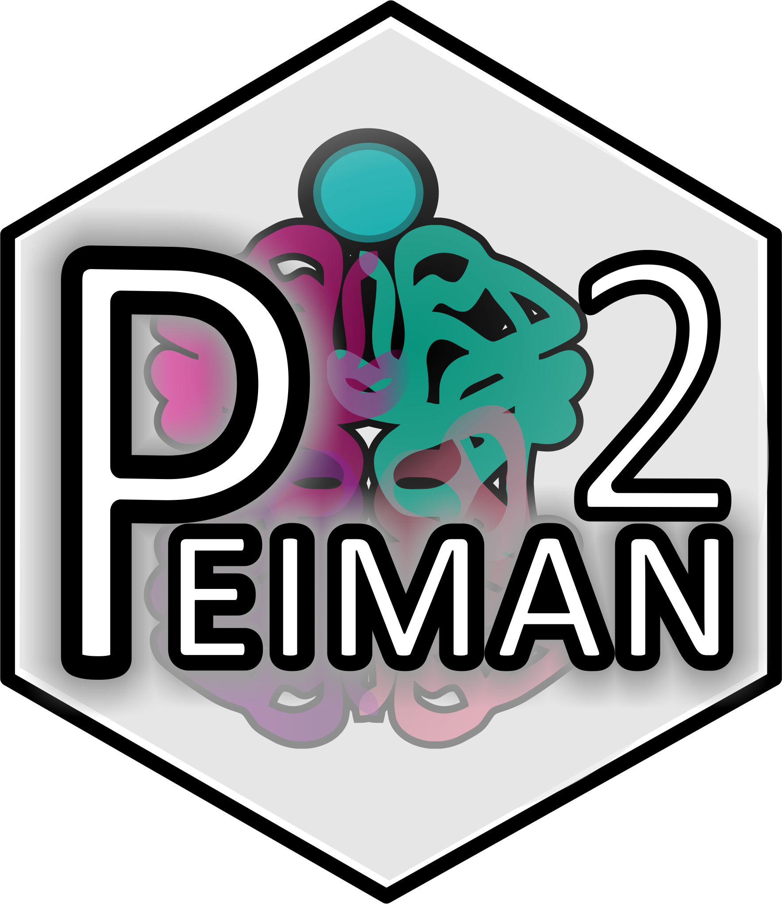
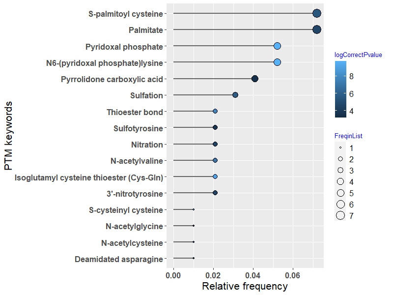
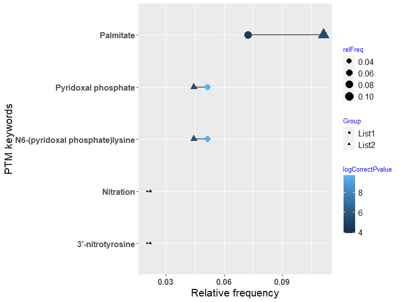
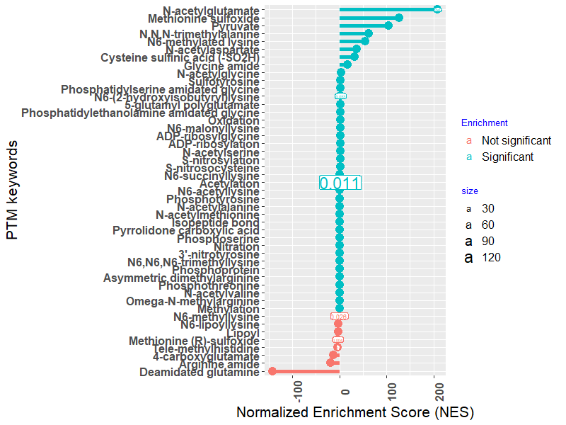

<!-- README.md is generated from README.Rmd. Please edit that file -->

# PEIMAN2 <a href='https://github.com/jafarilab/PEIMAN2'></a>

<!-- badges: start -->

[](https://cran.r-project.org/package=PEIMAN2)
[](https://github.com/jafarilab/PEIMAN2/releases)
[](https://github.com/jafarilab/PEIMAN2)

<!-- badges: end -->

The PEIMAN2 package \[@PEIMAN2\] provides functions and mined database from UniProt for single enrichment analysis (SEA) and 
protein set enrichment analysis (PSEA) in a list of protein. The database is updated regularly with monthly changes in UniProt/SwissProt repository.
To ensure you have the latest version of database, make sure to install the package from GitHub. 


## Installation

You can install the released version of PEIMAN from
[CRAN](https://CRAN.R-project.org) with:

``` r
install.packages("PEIMAN2")
```

And the development version from [GitHub](https://github.com/) with:

``` r
# install.packages("devtools")
devtools::install_github("jafarilab/PEIMAN2")
```

## Example

### Singular Enrichment Analysis (SEA)

``` r
# Load PEIMAN2 package
library(PEIMAN2)

# First example dataset
pl1 <- exmplData1$pl1

# Run SEA on the list
enrich1 <- runEnrichment(protein = pl1, os.name = 'Homo sapiens (Human)')

head(enrich1, n = 6)
```


``` r
# Second example dataset
pl1 <- exmplData1$pl2

# Run SEA on the list
enrich2 <- runEnrichment(protein = pl2, os.name = 'Homo sapiens (Human)')
```


### Plotting SEA for one list

```r
plotEnrichment(x = enrich1, sig.level = 0.05)
```



### Integration and matching analysis of two lists

```r
plotEnrichment(x = enrich1, y = enrich2, sig.level = 0.05)
```



### Protein Set Enrichment Analysis (PSEA)

``` r
psea_res <- runPSEA(protein = exmplData2, os.name = 'Rattus norvegicus (Rat)', nperm = 1000)
View(psea_res[[1]])
```

### Plotting PSEA

``` r
plotPSEA(x = psea_res, number.rep = 20)
```



``` r
plotRunningScore(x = psea_res)
```


### Translate PEIMAN results for Mass spectrometry searching tools

``` r
MS <- psea2mass(x = psea_res, sig.level = 0.05)
```


## License

[](https://opensource.org/licenses/)
