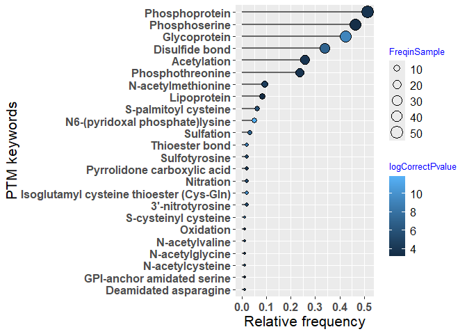
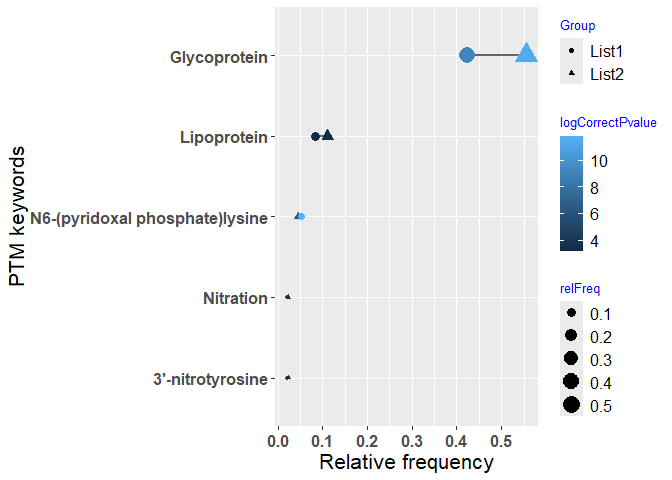
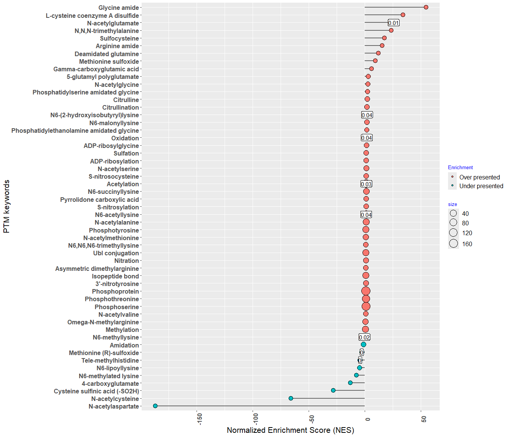
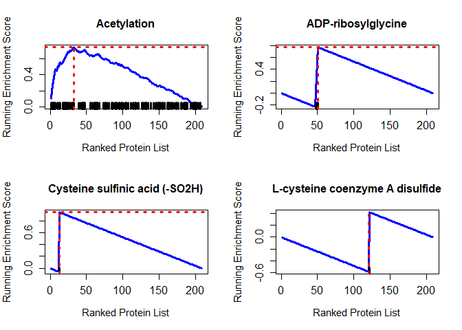
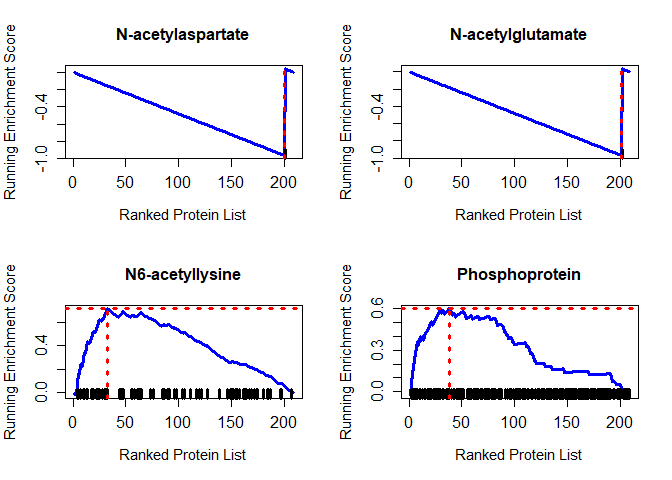

README
================
2026-16-06

# PEIMAN2 <a href='https://github.com/pnickchi/PEIMAN2/'></a>

<!-- badges: start -->

[](https://cran.r-project.org/package=PEIMAN2)
[](https://github.com/pnickchi/PEIMAN2)

<!-- badges: end -->

The PEIMAN2 package provides functions and a mined UniProt-based database for
singular enrichment analysis (SEA) and protein set enrichment analysis (PSEA)
using lists of proteins.

PEIMAN2 includes a bundled internal database so that the package works
immediately after installation and remains suitable for CRAN examples and
checks. However, the PEIMAN database and UniProt PTM list are updated over time.
Users who want the most recent external data can download and cache updated
versions directly from the PEIMAN2 database repository [here](https://github.com/pnickchi/PEIMAN2-database)
or update their local database manually by following steps in **Database Updates** section in this readme file.

## Installation

You can install the released version of PEIMAN from
[CRAN](https://CRAN.R-project.org) with:

``` r
install.packages("PEIMAN2")
```

And the development version from [GitHub](https://github.com/) with:

``` r
# install.packages("devtools")
devtools::install_github("jafarilab/PEIMAN2")
# or
devtools::install_github("pnickchi/PEIMAN2")
```

## Database updates

By default, PEIMAN2 uses the bundled database included with the installed
package version:

``` r
enrich1 <- runEnrichment(
  protein = exmplData1$pl1,
  os.name = "Homo sapiens (Human)"
)
```

To download and cache the latest available external PEIMAN database and UniProt
PTM list, use:

``` r
update_peiman_database()
```

After updating the cache, you can run enrichment analysis with the latest cached
database:

``` r
enrich_latest <- runEnrichment(
  protein = exmplData1$pl1,
  os.name = "Homo sapiens (Human)",
  database_version = "latest"
)
```

You can also download and use a specific database version for reproducible
analysis:

``` r
update_peiman_database(version = "2026-06-15")

enrich_2026_06_15 <- runEnrichment(
  protein = exmplData1$pl1,
  os.name = "Homo sapiens (Human)",
  database_version = "2026-06-15"
)
```

For mass spectrometry translation functions, the UniProt PTM list version can
also be selected. For example:

``` r
MS_latest <- sea2mass(
  x = enrich_latest,
  sig.level = 0.05,
  ptmlist_version = "latest"
)
```

or with a specific cached PTM list version:

``` r
MS_2026_06_15 <- sea2mass(
  x = enrich_2026_06_15,
  sig.level = 0.05,
  ptmlist_version = "2026-06-15"
)
```

The downloaded files are stored in the user's local PEIMAN2 cache directory:

``` r
tools::R_user_dir("PEIMAN2", which = "cache")
```

The default value is `database_version = "bundled"`, which uses the internal
database included in the version of the package installed from CRAN. This means
that package loading, examples, and standard workflows do not require internet
access.

## Example

### Singular Enrichment Analysis (SEA)

``` r
# Load PEIMAN2 package
library(PEIMAN2)

# First example dataset
pl1 <- exmplData1$pl1

# Run SEA on the list
enrich1 <- runEnrichment(protein = pl1, os.name = 'Homo sapiens (Human)')

head(enrich1, n = 6)
```

    ##                                        PTM FreqinPopulation FreqinSample Sample
    ## 1           N6-(pyridoxal phosphate)lysine               53            5     97
    ## 2 Isoglutamyl cysteine thioester (Cys-Gln)                7            2     97
    ## 3                             Glycoprotein             4726           41     97
    ## 4                           Thioester bond               11            2     97
    ## 5                     S-cysteinyl cysteine                3            1     97
    ## 6                           Disulfide bond             3885           33     97
    ##   Population pvalue corrected pvalue
    ## 1      20431  2e-07            7e-06
    ## 2      20431  4e-06            7e-05
    ## 3      20431  8e-06            1e-04
    ## 4      20431  2e-05            2e-04
    ## 5      20431  7e-05            5e-04
    ## 6      20431  1e-04            9e-04
    ##                                                                                                                                                                                                                                                                                                                                       AC
    ## 1                                                                                                                                                                                                                                                                                                 Q96QU6; Q4AC99; Q8N5Z0; Q8NHS2; P17174
    ## 2                                                                                                                                                                                                                                                                                                                         P01023; A8K2U0
    ## 3 P08195; P08908; P28222; P28221; P28566; P30939; P28223; P41595; P28335; P46098; O95264; Q70Z44; A5X5Y0; Q13639; P47898; P34969; P21589; P02763; P19652; P20848; P01009; P04217; P08697; P02750; P01023; A8K2U0; U3KPV4; Q9NPC4; Q9UNA3; P05067; P30542; P29274; P29275; P0DMS8; P22760; Q15758; P01011; P54619; Q9UGJ0; Q9UGI9; Q13131
    ## 4                                                                                                                                                                                                                                                                                                                         P01023; A8K2U0
    ## 5                                                                                                                                                                                                                                                                                                                                 P01009
    ## 6                                                                 P08195; P08908; P28222; P28221; P28566; P30939; P28223; P41595; P28335; P46098; O95264; Q8WXA8; A5X5Y0; Q13639; P47898; P50406; P34969; P21589; P05408; P02763; P19652; P04217; P08697; P02750; P01023; A8K2U0; P05067; P30542; P29274; P29275; P0DMS8; Q9NS82; P22760

``` r
# Second example dataset
pl2 <- exmplData1$pl2

# Run SEA on the list
enrich2 <- runEnrichment(protein = pl2, os.name = 'Homo sapiens (Human)')
```

### Plotting SEA for one list

``` r
plotEnrichment(x = enrich1, sig.level = 0.05)
```

    ## Warning: Using `size` aesthetic for lines was deprecated in ggplot2 3.4.0.
    ## ℹ Please use `linewidth` instead.
    ## ℹ The deprecated feature was likely used in the PEIMAN2 package.
    ##   Please report the issue to the authors.
    ## This warning is displayed once per session.
    ## Call `lifecycle::last_lifecycle_warnings()` to see where this warning was
    ## generated.

<!-- -->

### Integration and matching analysis of two lists

``` r
plotEnrichment(x = enrich1, y = enrich2, sig.level = 0.05)
```

<!-- -->

### Protein Set Enrichment Analysis (PSEA)

``` r
psea_res <- runPSEA(protein = exmplData2, os.name = 'Rattus norvegicus (Rat)', nperm = 100)
```

    ## Warning: `rerun()` was deprecated in purrr 1.0.0.
    ## ℹ Please use `map()` instead.
    ##   # Previously
    ##   rerun(100, psea(x = protein, y = pro.pathway, p = pexponent, perm = TRUE))
    ## 
    ##   # Now
    ##   map(1:100, ~ psea(x = protein, y = pro.pathway, p = pexponent, perm = TRUE))
    ## ℹ The deprecated feature was likely used in the PEIMAN2 package.
    ##   Please report the issue to the authors.
    ## This warning is displayed once per session.
    ## Call `lifecycle::last_lifecycle_warnings()` to see where this warning was
    ## generated.

``` r
head(psea_res[[1]], n = 6)
```

    ##                               PTM pval pvaladj FreqinPopulation FreqinSample
    ## 1                     Acetylation    0       0             1787          125
    ## 2              ADP-ribosylglycine    0       0                4            4
    ## 3  Cysteine sulfinic acid (-SO2H)    0       0                1            1
    ## 4 L-cysteine coenzyme A disulfide    0       0                1            1
    ## 5               N-acetylaspartate    0       0                1            1
    ## 6               N-acetylglutamate    0       0                1            1
    ##           ES         NES nMoreExtreme size      Enrichment
    ## 1  0.7455919    1.177273            3  125  Over presented
    ## 2  0.7707317    1.470956           29    4  Over presented
    ## 3  0.9423077  -27.960452            5    1 Under presented
    ## 4 -0.5817308   34.084507           43    1  Over presented
    ## 5 -0.9615385 -187.037037            6    1 Under presented
    ## 6 -0.9663462   25.632576            1    1  Over presented
    ##                                                                                                                                                                                                                                                                                                                                                                                                                                                                                                                                                                                                                                                                                                                                                                                                                                                                                                                                                                                                                                       AC
    ## 1 P0C1X8; P11030; P60711; P63259; Q63028; Q62847; Q62848; Q9WUC4; P31399; P29419; P21571; P15999; D3ZAF6; Q9JJW3; O08839; P0DP29; P0DP30; P0DP31; P18418; P26772; P63039; B0K020; P08081; P08082; P45592; Q91ZN1; P11240; Q63768; P10715; P62898; Q9JHL4; Q7M0E3; P62628; Q07266; P84060; P62870; P15429; P07323; P60841; P56571; B0BN94; P55053; P55051; P07483; Q62658; Q32PX7; Q99PF5; Q5XI73; Q63228; P62994; P01946; P02091; P11517; P62959; P82995; P34058; P27321; Q5XI72; P50411; Q6AXU6; Q5BK20; P11980; Q99MZ8; Q792I0; Q66HF9; P15205; Q5M7W5; P30009; P02688; B0BN72; P30904; O35763; P62775; Q05982; Q71UE8; Q9JJ19; P13084; Q01205; P08461; Q920Q0; O88767; P04785; P31044; O55012; P10111; Q6J4I0; Q9R063; Q9EPC6; P02625; Q63475; P51583; Q68A21; P02401; P62982; P62859; Q6RJR6; Q9JK11; Q63945; B0BN85; P07632; Q66HL2; P28042; O35814; P13668; P37377; Q62880; P19332; P68370; Q6P9V9; Q6AYZ1; Q68FR8; Q5XIF6; Q6PEC1; P11232; P62076; P62078; Q9WV97; P48500; P04692; P58775; Q63610; P09495; Q7M767; Q9Z1A5; P63045
    ## 2                                                                                                                                                                                                                                                                                                                                                                                                                                                                                                                                                                                                                                                                                                                                                                                                                                                                                                                                                                                                         P62986; P62982; P0CG51; Q63429
    ## 3                                                                                                                                                                                                                                                                                                                                                                                                                                                                                                                                                                                                                                                                                                                                                                                                                                                                                                                                                                                                                                 O88767
    ## 4                                                                                                                                                                                                                                                                                                                                                                                                                                                                                                                                                                                                                                                                                                                                                                                                                                                                                                                                                                                                                                 Q05982
    ## 5                                                                                                                                                                                                                                                                                                                                                                                                                                                                                                                                                                                                                                                                                                                                                                                                                                                                                                                                                                                                                                 P60711
    ## 6                                                                                                                                                                                                                                                                                                                                                                                                                                                                                                                                                                                                                                                                                                                                                                                                                                                                                                                                                                                                                                 P63259
    ##                                                                                                                                                                                                      leadingEdge
    ## 1 P62628; P31044; P37377; P45592; P11030; P02625; P29419; P62775; P21571; O88767; P31399; P02688; P08082; P62898; P63045; P62076; P11232; O35814; Q9WUC4; Q62658; Q63228; P07632; Q5XI73; B0K020; P08081; P62959
    ## 2                                                                                                                                                                                 P62982; P0CG51; P62986; Q63429
    ## 3                                                                                                                                                                                                         O88767
    ## 4                                                                                                                                                                                                         P31044
    ## 5                                                                                                                                                                                                         P31044
    ## 6                                                                                                                                                                                                         P31044

### Plotting PSEA

``` r
plotPSEA(x = psea_res)
```



``` r
plotRunningScore(x = psea_res, nplot = 8) 
```

<!-- --><!-- -->

### Translate PEIMAN results for Mass spectrometry searching tools

``` r
psea2mass(x = psea_res, sig.level = 0.05)
```

    ##      MOD_ID                       name
    ## 1 MOD:00064         N6-acetyl-L-lysine
    ## 2 MOD:01819       N6-succinyl-L-lysine
    ## 3 MOD:00085         N6-methyl-L-lysine
    ## 4 MOD:00322      1'-methyl-L-histidine
    ## 5 MOD:00720 L-methionine (R)-sulfoxide
    ## 6 MOD:00053   N-acetyl-L-glutamic acid
    ## 7 MOD:00267   L-cysteine sulfinic acid
    ##                                                                                                                                                                                                                                                           def
    ## 1 "converts an L-lysine residue to N6-acetyl-L-lysine." [ChEBI:17752, DeltaMass:214, OMSSA:24, PubMed:11369851, PubMed:11857757, PubMed:11999733, PubMed:12175151, PubMed:14730666, PubMed:15350136, PubMed:1680872, PubMed:670159, RESID:AA0055, Unimod:1#K]
    ## 2                                                                                                                                                    "converts an L-lysine residue to N6-succinyl-L-lysine." [PubMed:16582421, PubMed:21151122, RESID:AA0545]
    ## 3                                                                                                              "converts an L-lysine residue to N6-methyl-L-lysine." [ChEBI:17604, DeltaMass:165, PubMed:11875433, PubMed:3926756, RESID:AA0076, Unimod:34#K]
    ## 4                                                                                "converts an L-histidine residue to tele-methyl-L-histidine." [PubMed:10601317, PubMed:11474090, PubMed:11875433, PubMed:6692818, PubMed:8076, PubMed:8645219, RESID:AA0317]
    ## 5                                                                                               "oxygenates an L-methionine residue to L-methionine sulfoxide R-diastereomer." [ChEBI:45764, PubMed:21406390, PubMed:22116028, PubMed:23911929, RESID:AA0581]
    ## 6                                                                                                                                              "converts an L-glutamic acid residue to N-acetyl-L-glutamic acid." [ChEBI:17533, PubMed:6725286, RESID:AA0044]
    ## 7                                                                                     "dioxygenates an L-cysteine residue to L-cysteine sulfinic acid." [ChEBI:16345, OMSSA:162, PubMed:12686488, PubMed:9252331, PubMed:9586994, RESID:AA0262, Unimod:425#C]
    ##   FreqinSample
    ## 1           75
    ## 2           31
    ## 3            9
    ## 4            2
    ## 5            2
    ## 6            1
    ## 7            1
