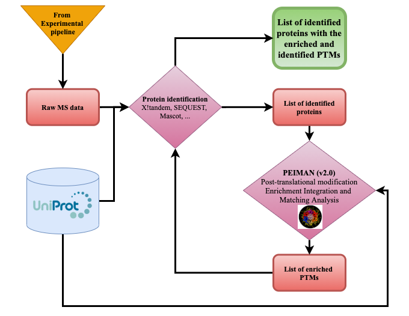

```{r, include = FALSE}
knitr::opts_chunk$set(
  collapse = TRUE,
  comment = "#>"
)
```


<!--This article is useful for vignette and also for the manuscript:
 https://academic.oup.com/nar/article/37/1/1/1026684?login=true-->


## 1 Introduction
This section briefly describes:    

- Introduction to PEIMAN v1    
The annotation enrichment analysis increases the chance of identifying relevant biological pathways in a list of genes or proteins. The post translational enrichment, integration, and matching analysis (PEIMAN v1) software was introduced to provide a systematic framework to identify more probable and enriched post-translational modification (PTM) terms in a list of proteins obtained from high-throughput technologies [@nickchi2015]. PEIMAN maps a large list of proteins to PTM pathways and test for their statistical significance, using a hypergeometric test. PEIMAN uses the most traditional way of enrichment analysis, by getting a list of proteins selected by user, and search for enriched PTM terms one by one. This strategy is called Singular Enrichment Analysis (SEA). Although this is a very promising approach for identifying biological pathways, the quality of selected list by researcher can potentially affect results at the end of the analysis.   

- The problem this package is trying to solve now    
To avoid this, we extend our enrichment framework to a wider class of enrichment analysis called Gene Set Enrichment Analysis or GSEA [@Subramanian2005]. The underlying idea of GSEA is very similar to SEA. Instead of applying a cutoff on input genes obtained from micro array experiments (either p-value or fold-change in gene expression), a 'no-cutoff' strategy is considered. The immediate benefits of this approach is to reduce the bias of gene selection and include genes with a low change in their expression level to participate in final analysis. The maximum value of the running score profile for ranked genes in each enrichment category is then calculated and compared with random scores obtained from permutation. More details on [@Subramanian2005]. This framework can be expanded to enrichment analysis in proteins. Inspired by GSEA idea, we here introduce a package in R for Protein Set Enrichment Analysis (PSEA).  


- Different features of this package    
The database in PEIMAN package updates monthly according to changes in UniProt. The package can be used to perform singular enrichment analysis (SEA) and visualize the results. PEIMAN can also be used to match and integrate results of two SEA analysis (for the same species) by visualizing their common pathways. To correct for biases in SEA, we implement protein set enrichment analysis (PSEA) as a new tool for computational community. Researchers can use this package to run PSEA and visualize the results. (To do list PN with help from MJ: Add some details about MS part for package features)


 

<!-- For package object such as dataset and function use back tick inside the text istead of \textit -->


## 2 Example data
We use the following datasets to demonstrate our work:   
1) `exmplData1`: This dataset contains two list of human proteins randomly selected from UniProt. The first list contains 45 randomly selected proteins. The second one contains of 97 randomly selected proteins. We use these lists for regular enrichment purposes. Both lists belongs to Homo Sapiens (Human). Note: Only the first 10 proteins in each list are shown.  

```{r show data1,echo=FALSE, results='asis', booktabs = TRUE}
knitr::kable( head(PEIMAN2::exmplData1$pl1), col.names = '', caption = '')
knitr::kable( head(PEIMAN2::exmplData1$pl2), col.names = '', caption = '')
```

2) `exmplData2`: For an example data to perform protein set enrichment analysis, we consider dataset described in [@gholizadeh2021]. 

```{r show data2,echo=FALSE, results='asis'}
knitr::kable(PEIMAN2::exmplData2[1:6,], caption='beatAML dataset samples')
```


## 3 Singular Enrichment analysis (SEA)
In this section, we introduce the functions for singular enrichment analysis (SEA). The functions in this section are divided into two parts, functions for enrichment and functions for plotting. We use `exmplData1` in this part.

### 3.1 Enrichment   
We can use `runEnrichment()` function to run singular enrichment analysis in one list. This function takes proteins identified by their UniProt accession code, along with taxonomy name of species and returns a dataframe with PTM lists. Let's look at 97 randomly selected human proteins from UniProt to illustrate how this function works. This data is saved as a vector of characters in `exmplData1`. 
<!-- Please avoid using '=' for object assignment use '<-' -->
```{r}
library(PEIMAN2)
pl1 <- exmplData1$pl1
pl1[1:10]
```


In `runEnrichment` function, we pass pl1 and os.name to perform SEA as follows and save the results in "enrich1". 

```{r}
enrich1 <- runEnrichment(protein = pl1, os.name = 'Homo sapiens (Human)')
knitr::kable(enrich1, format = 'html')
```


The results saved in "enrich1" is a dataframe with the following columns:

- `PTM`: Post-translational modification (PTM) pathway/keyword.
- `Freq in Uniprot`: The total number of proteins with this PTM in UniProt.
- `Freq in List`: The total number of proteins with this PTM in list.
- `Sample`: Number of proteins in the given list.
- `Population`: Total number of proteins in the current version of PEIMAN databse.
- `pvalue`: The p-value obtained from hypergeometric test (enrichment analysis).
- `corrected pvalue`: Adjusted p-value to correct for multiple testing.
- `AC`: Uniprot accession code (AC) of proteins with each PTM.


The os.name is the exact taxonomy name of species that you are working with. The name should be exactly the same as UniProt definition. To facilitate searching for this name, you can pass your protein list with UniProt accession ID to `getTaxonomyName` function as follows. The result is the exact taxonomy name of protein list. In the following example, the exact taxonomy name is printed: 

```{r}
getTaxonomyName(x = exmplData1$pl1)
```


Note: By default, p-values are adjusted by "BH" method. You can change this behavior by passing your desired method to `p.adj.method` argument in `runEnrichment`. In console, run `p.adjust.methods` to get a list of possible values.


Similarly, we can run SEA for the second list of proteins:

```{r}
pl2 <- exmplData1$pl2
enrich2 <- runEnrichment(protein = pl2, os.name = 'Homo sapiens (Human)')
knitr::kable(enrich2, format = 'html')
```


### 3.2 Plotting    
The `plotEnrichment` function allows researchers to visualize singular enrichment analysis for one set of proteins or match, analyse, and integrate results for two sets of proteins. To read more about this match and integration, please read details at [@nickchi2015]. We start by plotting the results of one analysis.

```{r fig.dim = c(8, 6)}
plotEnrichment(x = enrich1, sig.level = 0.05)
```


The results is a Lollipop plot which presents "Relative frequency" of each "PTM keywords" along with their corrected p-value measured in log scale. Note that only significant PTMs are shown. The default value for significance level is 5 percent. One can also visualize and match the results of two enrichment. For example, we can see the integrated results of `enrich1` and `enrich2` by the following line of code:

```{r fig.dim = c(8,6)}
plotEnrichment(x = enrich1, y = enrich2, sig.level = 0.05)
```

The plot presents the 'Relative frequency' of common PTM terms among two enriched list (x and y). The coloring is the corrected p-value measured in log scale. By default a significance level of 5 percent is set to filter results. This can be modified by `sig.level` parameter. 


## 4 Protein set enrichment analysis (PSEA) 
In this section, we introduce the functions for protein set enrichment analysis (PSEA). The functions in this section are divided into two parts, functions for PSEA and functions for plotting the results. We use `exmplData2` in this part.

### 4.1 PSEA   
In order to run protein set enrichment analysis (PSEA), you can use `runPSEA` function. This function takes the following inputs:

- `protein`: A character vector with protein UniProt accession.
- `os.name`: A character of length one for the exact name of organism name. 
- `pexponent`: Enrichment weighting exponent, p. The default value is 1. For values of p < 1, one can detect incoherent patterns in a set of protein. If one expects a small number of proteins to be coherent in a large set, then p > 1 is a good choice.
- `nperm`: Number of permutation to adjust for multiple testing in different pathways. Default is 1000.
- `p.adj.method`: The adjustment method to correct for multiple testing. Run `p.adjust.methods` to get a list
of possible methods.
- `sig.level`: The significance level to filter pathways (applies to adjusted p-value), 0.05 is the default value.
- `minSize`: PTM pathways with a lower number of proteins than minSize are excluded. The default value is one.

<!-- No need to show the progress bar -->

```{r}
psea_res <- runPSEA(protein = exmplData2, os.name = 'Rattus norvegicus (Rat)', nperm = 100)
```

The result is a list with 6 elements. The first element of this list is important: A dataframe with protein set enrichment analysis (PSEA) results. Every row corresponds to a post-translational modification (PTM) pathway with the following columns:

- `pval`: p-value for singular enrichment analysis.
- `pvaladj`: Adjusted p-value
- `ES`: Enrichment score
- `NES`: Enrichmnt score normalized to mean enrichment of random samples of the same size.
- `nMoreExtreme`: Number of times the permuted sample resulted in profile with ES larger than abs(ES original)
- `size`: Number of proteins in the pathway
- `Enrichment`: Whether the proteins in the pathway have been enriched in the list.
- `leadingEdge`: UniProt accession code of leading edge proteins that drive the enrichment. 

```{r}
knitr::kable(psea_res[[1]], format = 'html')
```


### 4.2 Plotting   
We now introduce the plotting features for protein set enrichment analysis. Two functions are included to visualize PSEA results returned from `runPSEA` function. The first plot is generated by `plotPSEA` function and shows Normalized Enrichment Score (NES) for each PTM pathway. User can restrict the number of pathways to draw based by adjusting sig.level parameter (default value is 0.05). The coloring of the plot indicates if the pathway is enriched or not.


```{r fig.dim = c(10,8)}
#plotPSEA(x = psea_res)
```

<!-- I think it is better to improve label size inside plot -->


The second plot is generated by `plotRunningScore` function. A running enrichment score plot for each PTM can be plotted.  

```{r echo = FALSE}
plotRunningScore(x = psea_res)
```


## 5. Translate PEIMAN results for Mass spectrometry searching tools
<!-- Add this section also based on our last discussion to add one or two more functions -->

In addition to the introduced features and extensions from previous version, the results from PEIMAN can also be utilized in Mass spectrometry searching tools. The enriched PTM terms in list of proteins generated by `runPSEA` function in the previous step can be searched in subset of protein modifications database. `psea2mass` function takes PSEA results and a significant level (default value is 0.05) and returns protein modification of statistically significant pathways for later searches in mass spectrometry tools. For example, continuing from `exmplData2` for PSEA, we call `psea2mass` function as follows:

```{r}
MS <- psea2mass(x = psea_res, sig.level = 0.05)
MS

# enrichment2mass
```


## References 
